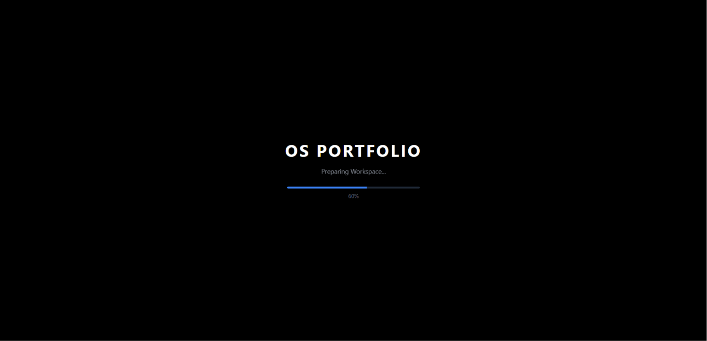
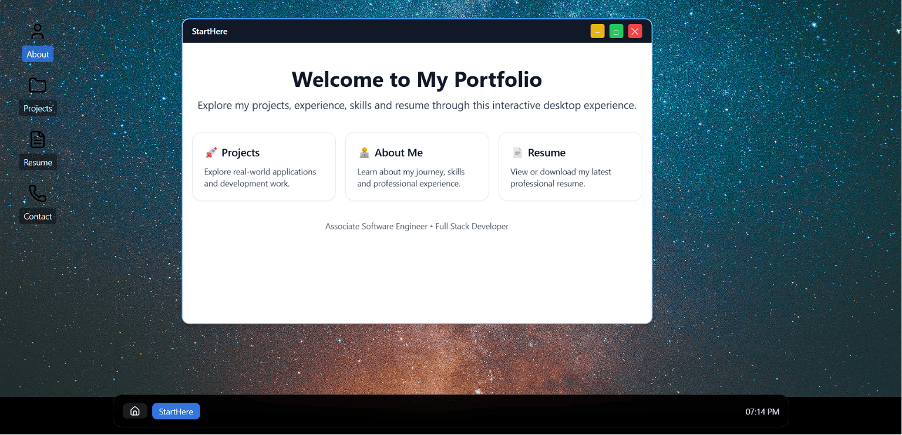
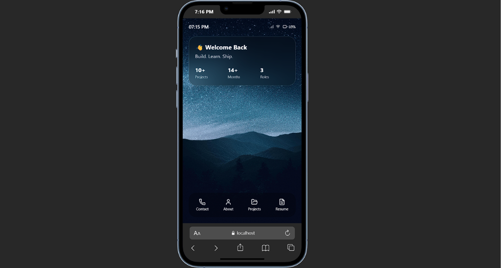
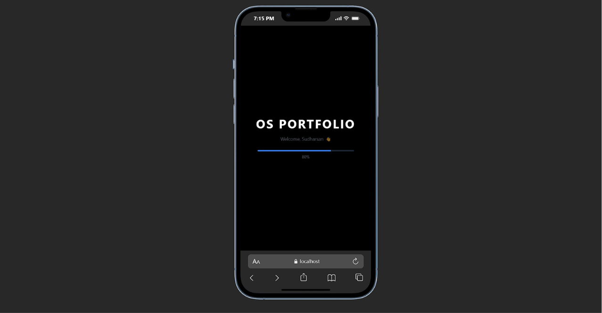

# 💻 OS Portfolio

An interactive developer portfolio inspired by a modern operating system.

Instead of a traditional portfolio website, this project lets visitors explore my work through a **desktop OS-style interface** on larger screens and a **mobile OS-style experience** on smaller devices.

Built with React, Tailwind CSS, Framer Motion, and modern component-based architecture.

---

## 🚀 Live Demo

**[View OS Portfolio](https://os-portfolio-seven-wheat.vercel.app/)**

---

## ✨ Highlights

### 🖥️ Desktop OS Experience

* OS-inspired desktop interface
* Draggable application windows
* Minimize, maximize, restore, close, and focus behavior
* Window stacking and z-index management
* Interactive glass taskbar
* Live time and date
* Location-based weather when permission is granted
* Graceful fallback when location is unavailable
* Centered Home button
* Taskbar app icons
* Click an active taskbar icon to minimize or restore an app
* Drag taskbar icons to reorder them
* Static and auto-hide taskbar modes

### 📱 Mobile OS Experience

* Dedicated mobile layout
* Mobile status bar
* Mobile wallpaper
* Swipeable portfolio widget
* Local developer fun facts
* Developer insights and welcome guidance
* Touch and pointer-based widget interaction
* Bottom gesture bar navigation
* Project details with mobile-friendly navigation
* Responsive layouts across screen sizes

### 🧩 Project Explorer

* Interactive project cards
* Project screenshots and gallery
* Dynamic project information
* Dynamic project type
* Dynamic technology stack
* Dynamic feature lists
* GitHub and Live Demo links when available
* Professional fallback states when project information is missing

### 👤 About

* Profile photo and banner
* Developer introduction
* Skills and technologies
* Professional experience timeline
* GitHub, LinkedIn, and email links

### 📄 Resume

* Resume overview
* Open resume in a new browser tab
* Download resume
* Desktop PDF preview

### 📬 Contact

* Clean responsive contact form
* EmailJS integration
* Name, email, and message fields
* Loading state while sending

### ⚡ Startup Experience

* Custom OS boot screen
* Startup progress animation
* First-visit startup experience
* Returning visitors can skip the boot screen

---

## 🛠 Tech Stack

| Technology                  | Purpose                          |
| --------------------------- | -------------------------------- |
| **React.js**                | UI and component architecture    |
| **JavaScript (ES6+)**       | Application logic                |
| **Tailwind CSS**            | Styling and responsive design    |
| **Framer Motion**           | UI animations and transitions    |
| **Lucide React**            | Interface icons                  |
| **Vite**                    | Development and production build |
| **EmailJS**                 | Contact form email delivery      |
| **Open-Meteo**              | Weather data                     |
| **Browser Geolocation API** | Location-based weather           |

---

## 🧠 Architecture

The project separates the desktop and mobile experiences while sharing reusable application components and data.

```text
src/
├── apps/
│   ├── About/
│   ├── Contact/
│   ├── Hire/
│   ├── Projects/
│   │   ├── details/
│   │   ├── ProjectDetails.jsx
│   │   ├── ProjectDetailsWindow.jsx
│   │   ├── ProjectFile.jsx
│   │   └── ProjectsApp.jsx
│   ├── Resume/
│   └── StartHere/
│
├── components/
│   ├── mobile/
│   │   ├── widgets/
│   │   ├── MobileDock.jsx
│   │   ├── MobileGestureBar.jsx
│   │   └── MobileStatusBar.jsx
│   │
│   └── os/
│       ├── taskbar/
│       ├── Desktop.jsx
│       ├── Icon.jsx
│       ├── Taskbar.jsx
│       └── Window.jsx
│
├── context/
│   ├── TaskbarContext.jsx
│   └── WindowContext.jsx
│
├── data/
│   ├── profile.js
│   ├── projects.js
│   └── skills.js
│
├── hooks/
│   └── useDeviceType.js
│
└── layouts/
    ├── DesktopLayout.jsx
    └── MobileLayout.jsx
```

---

## 🧭 Navigation

### Desktop

```text
Desktop
   ↓
Start Here
   ↓
Open Applications
   ↓
Application Windows
   ↓
Taskbar Controls
```

### Mobile

```text
Home
 ├── About
 ├── Projects
 │    └── Project Details
 │         └── ◀ Back to Projects
 ├── Resume
 └── Contact
```

The mobile experience uses a gesture bar to return to the home screen.

---

## 📸 Screenshots

### Desktop



### Desktop Taskbar



### Mobile



### Project Experience



---

## ⚙️ Getting Started

### 1. Clone the repository

```bash
git clone https://github.com/Sudharsan-3/OS-Portfolio.git
```

### 2. Navigate into the project

```bash
cd OS-Portfolio
```

### 3. Install dependencies

```bash
npm install
```

### 4. Start the development server

```bash
npm run dev
```

### 5. Create a production build

```bash
npm run build
```

---

## 🔐 Environment Variables

The contact form uses EmailJS.

Create a `.env` file in the project root:

```env
VITE_EMAILJS_SERVICE_ID=your_service_id
VITE_EMAILJS_TEMPLATE_ID=your_template_id
VITE_EMAILJS_PUBLIC_KEY=your_public_key
```

Do not commit your `.env` file to Git.

---

## 🌦️ Weather

The desktop taskbar can display local weather using:

* Browser Geolocation API for coordinates
* Open-Meteo for weather data

Location permission is optional. If permission is denied or unavailable, the rest of the portfolio continues to work normally.

---

## 📱 Responsive Design

The portfolio uses separate desktop and mobile experiences:

```text
Desktop
→ OS-style desktop
→ Windows
→ Glass taskbar
→ Window controls

Mobile
→ Mobile OS interface
→ Widgets
→ Gesture navigation
→ Dedicated project details flow
```

The application automatically switches between layouts based on screen width.

---

## 🎯 Project Goals

This project was built to:

* Create a portfolio that feels different from a traditional website
* Experiment with OS-style interfaces
* Build reusable React components
* Practice responsive UI architecture
* Explore window management and interaction patterns
* Create a recruiter-friendly way to present projects and experience

---

## 🔮 Future Ideas

Possible future improvements include:

* PWA support
* More desktop customization
* Additional OS-style interactions
* Notification simulation
* More mobile system features
* Additional portfolio applications

---

### Built With

`React` `JavaScript` `Tailwind CSS` `Framer Motion` `Vite`

### Links

* **GitHub:** https://github.com/Sudharsan-3
* **LinkedIn:** https://www.linkedin.com/in/sudharsansdeveloper
* **Portfolio:** https://os-portfolio-seven-wheat.vercel.app/

---

## 📌 Note

This repository is a personal developer portfolio and learning project.
